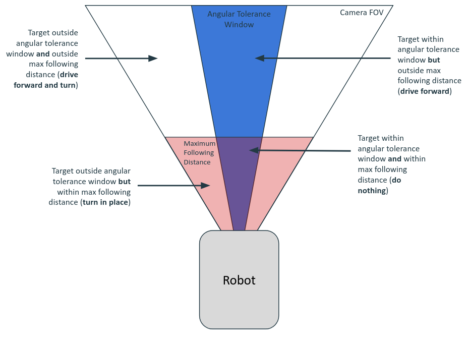

## Introduction
This file is meant to describe the features of each script in the [image_processing](image_processing) and each launchfile in the [launch](launch) folder.

# Scripts

## Image Display Program (not yet implemented on Jetson)

[`img_display_node.py`](image_processing/image_display_node.py) simply displays the raw images output by the depth camera. This is helpful for debugging and developing new programs, as it is taken directly from the camera without any further processing.

**Note:** this program is not necessary anymore, as RVIZ can be used to visualize image topics. However, it continues to be a part of this package to demonstrate how image topics can be subscribed to and processed.

## Image Saving Program (not yet implemented on Jetson)

[`img_save_node.py`](image_processing/image_save_node.py) saves the raw images received from the depth camera, as well as the mask images to a specified folder on the computer. The adjustment of various program parameters  is enabled through the manipulation of the constants defined at the top of the file. These include the save directory, folder name, save rate, and a variety of other constants that determine whether each image type is saved or not. For example, if a test is being run where only RGB images need to be saved, the [`SAVE_RGB`](image_processing/image_save_node.py#L19) constant can be set to true, while all other save selection constants can be set to false. This allows for flexibility during testing and ensures that only important data is saved.

**WARNING:** if the directory in which files are being saved already exists, this program will clear it before starting the saving process. This enables continued testing without filling up the computer’s disk space. To save the image files of a test permanently, they must either be moved or copied to a separate folder outside of the save folder. Alternatively, the [`SAVE_FOLDER_NAME`](image_processing/image_save_node.py#L10) and/or [`SAVE_PATH`](image_processing/image_save_node.py#L7) constants can be changed, leaving the previously saved data intact and creating a new directory to save image data to upon program startup.

## Image Processing Program

[`img_processor_node.py`](image_processing/image_processor_node.py) processes the images received from the depth camera and publishes the cartesian coordinates of the specified target prompt to a ROS topic. It feeds the raw rgb images to an image recognition model along with a text prompt. This then calculates a mask over the image for each tracked object, which it then finds the centeroid of, essentially finding the location of the centroid of each object. It then uses the depth data taken from the camera to calculate the cartesian coordinates of the centroid, along with the average depth over the entire object mask. It publishes all this data to a ROS topic using a custom msg structure (defined in the [process_msgs](/process_msgs) package). The program then compares the calculated masks with the given target phrase and sends the cartesian coordinates of the target centroid to another ROS topic. If two or more targets are detected, the program sends the coordinates of the target with the lowest average depth. This can be modified in the future if a different, more complex targeting algorithm is desired.

This program features a variety of ROS parameters that can be modified within the code itself, by using a launchfile, or when launching the node from the terminal. The following table gives a list of parameters:

### Parameter Table

| Name | Type | Description | Example Value |
| --- | --- | --- | --- |
| `prompt` | `string` | The prompt fed into the AI model for image detection. Multiple prompts can be detected by separating them with a period. | 'person.phone' |
| `target` | `string` | The target used to publish goal data for navigation. It **must** be contained in the prompt string. | 'person' |
| `target_confidence_threshold` | `double` | The minimum confidence the model must have to consider the object as a target (ranges from 0.0-0.99). | 0.5 |
| `print_output` | `boolean` | Determines whether the program prints information about each processed frame to the console. | False |
| `clear_output` | `boolean` | Determines whether the program clears the terminal before printing more information. | True |
| `regulate_process_rate` | `boolean` | Determines whether the processing rate should be regulated, or whether it should process as fast as possible. | False |
| `processing_rate` | `double` | Maximum processing frequency (in Hz). Only relevant if `regulate_process_frequency` is `True`. It should be noted that each processing cycle will take at minimum the amount of time needed to process one image, regardless of the set rate. If processing rate is 0, the rate will not be regulated. | 1.0 |
| `rgb_img_topic` | `string` | The ROS topic on which the RGB images from the depth camera are published. | 'zed/zed_node/rgb/image_rect_color' |
| `depth_img_topic` | `string` | The ROS topic on which the depth images from the depth camera are published. | 'zed/zed_node/depth/depth_registered' |
| `cam_info_topic` | `string` | The ROS topic on which the camera information (i.e. the instrinsic data) from the depth camera is published. | 'zed/zed_node/depth/camera_info' |

**Note:** changing the `prompt` parameter will change what the image recognition model will detect. This can be utilized to detect multiple objects in the image. The `target` parameter should contain only **one** object phrase, and **must** be contained within the prompt. This allows for detection of multiple objects, however the program sends the information of only one target to the robot control algorithm. This allows for some flexibility if multiple different kinds of objects need to be detected in the future.

## Mask Display Program (not yet implemented on Jetson)

[`mask_display_node.py`](image_processing/mask_display_node.py) receives the mask data and displays it using the OpenCV python package. It does this by overlaying each mask in green over the base RGB image. It then draws each centroid over those masks with accompanying text that describes the phrase (or object detected by the program) and the depth of the centroid and/or the average depth of the mask (in meters). This program also publishes the final image to a ROS topic, which is read by the image saving program for image saving.

**Note:** the mask display program relies on data published by the processing program, so should only be run after the processing program has started.

## Control Demo Program

[`ranger_control_demo.py`](image_processing/ranger_control_demo.py) is a simple demonstration program created to demonstrate and test the [image processing program](image_processing/image_processor_node.py)'s targetting functionality. This program drives the robot towards the target after receiving its location from the [image processing program](image_processing/image_processor_node.py). If the target is not within the angular tolerance (the angle spanning equally out from the robot's centerline in the horizontal plane, specified as a ROS parameter), the robot will turn towards the target until it is within the angular tolerance. Additionally, if the target is not within the following distance (depth from the robot to the target, also specified by the ROS parameter) the robot will drive forward until the target is within the following distance threshold. Both of these thresholds are visualized in the image below, along with the intended robot behaviour within and outside of those thresholds. The maximum linear and angular velocities of the robot can be specified through the launchfile or terminal, as they are also defined as ROS parameters.



## Utility Program
[`utils.py`](image_processing/utils.py) is a helper program that contains many of the calculation and evaluation functions used throughout this package. This allows for functions in the file to be used in multiple different files, increasing modularity, while also keeping the other files shorter and improving readability by consolidating subfunctions into a separate file.

## Test Programs
[`cuda_torch_test.py`](image_processing/cuda_torch_test.py) is a program that simply tests whether CUDA can be accessed using pytorch. This is important, as the AI model used in the [`image processing program`](image_processing/image_processor_node.py#L103) depends on pytorch for fast and efficient processing. Without it, this package is essentially unusable, as the processing times become unreasonable.

[`zed_depth_test.py`](image_processing/zed_depth_test.py) creates a simple ROS node that receives images from the ZED 2i depth camera and outputs the image size, as well as the depth value of the center pixel. This is useful for testing the functionality of the camera and demonstrates how the camera can be accessed using ROS.

# Launchfiles
## Object Detection
[`object_detection.launch.py`](launch/object_detection.launch.py) is designed to allow the user to select which programs they would like to launch dynamically. It includes boolean launch parameters that activate/deactivate the following programs:
| Program to Activate/Deactivate | Parameter |
| --- | --- |
| [image display](image_processing/image_display_node.py) | [`run_img_display`](launch/object_detection.launch.py#L10) |
| [image saving](image_processing/image_save_node.py) | [`run_img_save`](launch/object_detection.launch.py#L11) |
| [mask display](image_processing/mask_display_node.py) | [`run_mask_display`](launch/object_detection.launch.py#L12) |

These launch parameters can be modified by changing their default values in the launchfile itself, or they can be modified at runtime by specifying the desired parameter directly in the launch command:
```bash
ros2 launch image_processing object_detection.launch.py run_mask_display:='False'
```

This launchfile also includes ROS parameter declarations which can be used to set specific variables used in a ROS node, allowing dynamic configuration of program behaviour without having to modify the code itself. Support for these is currently only included for the [image processing program](image_processing/image_processor_node.py). For a list of parameters, their datatypes, their descriptions, and some examples, see [this table](./README.md#parameter-table).

## Object Detection Lite
[`object_detection_lite.launch.py`](launch/object_detection_lite.launch.py) is designed to be a barebones version of the [`object_detection.launch.py`](launch/object_detection.launch.py) launchfile. It simply defines a few parameters and then launches the [image processing program](image_processing/image_processor_node.py). This file is intended to be the one run when running the navigation stack. It can be included in whatever launchfile is eventually used to launch the target finding and navigation processes.

## Object Detection and Control
[`object_detection_and_control.launch.py`](launch/object_detection_and_control.launch.py) is designed to launch the [image processing program](image_processing/image_processor_node.py) along with the [control demonstration program](image_processing/ranger_control_demo.py). It does not launch any of the other scripts in the package, as it is meant to be a simple barebones demo.